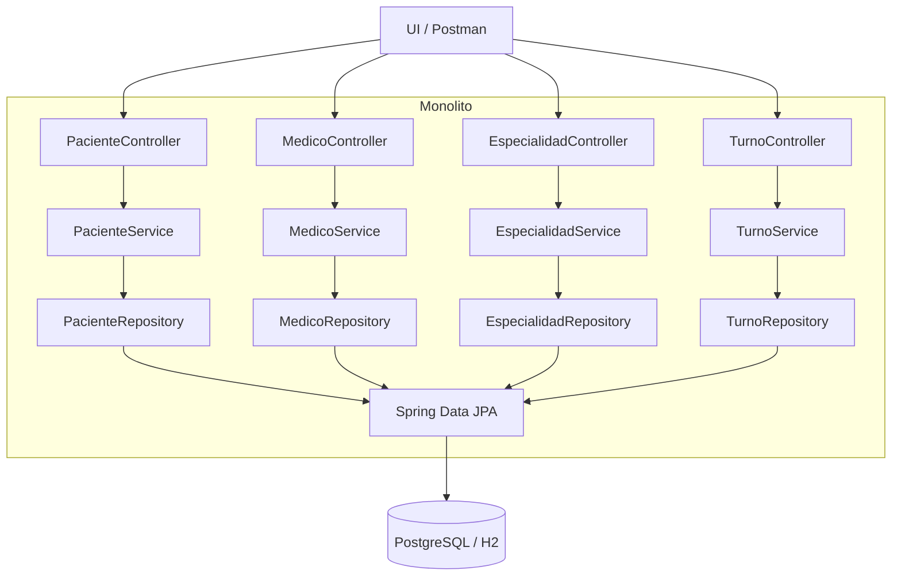
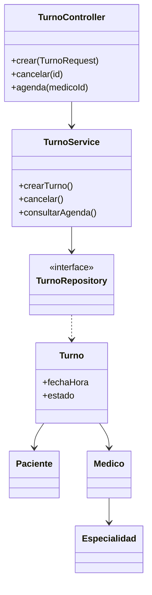
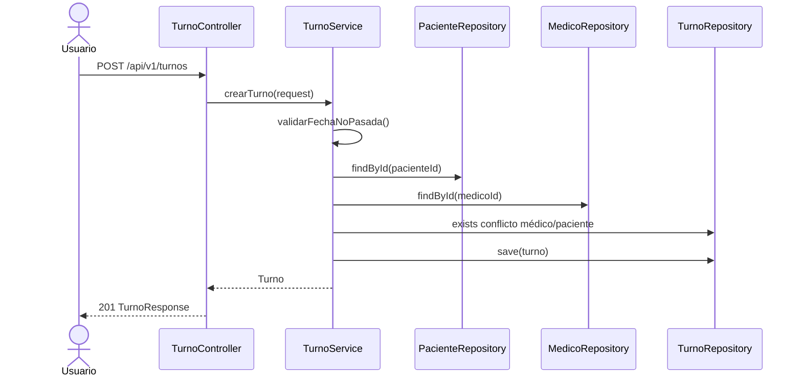

# Arquitectura Monolítica por Capas — Turnos Médicos

> **Documento histórico (referencia).** La arquitectura vigente del proyecto es **Domain-Driven Design**.
> Consulta el documento oficial: **[ARQUITECTURA_DDD.md](ARQUITECTURA_DDD.md)**

Documento para presentación universitaria. Stack: **Java 17**, **Spring Boot 3**, **Spring Data JPA**, **PostgreSQL**, **Maven**.

---

## 1. Estructura completa de carpetas

```
src/main/java/com/gestionturnos/
├── TurnosMedicosApplication.java
├── config/
│   └── DataSeeder.java
├── model/
│   ├── Especialidad.java
│   ├── Paciente.java
│   ├── Medico.java
│   ├── Turno.java
│   └── enums/EstadoTurno.java
├── repository/
│   ├── EspecialidadRepository.java
│   ├── PacienteRepository.java
│   ├── MedicoRepository.java
│   └── TurnoRepository.java
├── service/
│   ├── EspecialidadService.java
│   ├── PacienteService.java
│   ├── MedicoService.java
│   ├── TurnoService.java
│   └── exception/
├── presentation/
│   ├── controller/
│   ├── dto/request|response/
│   ├── mapper/
│   └── exception/
└── app/                          # Legado (perfil espagueti)
    └── SistemaTurnosController.java

src/main/resources/
├── application.yml
├── db/schema-postgresql.sql
└── static/                       # UI de prueba
```

---

## 2. Entidades (`model/`)

| Entidad | Tabla | Relaciones |
|---------|-------|------------|
| `Especialidad` | especialidades | — |
| `Paciente` | pacientes | — |
| `Medico` | medicos | `@ManyToOne` → Especialidad |
| `Turno` | turnos | `@ManyToOne` → Paciente, Medico |
| `EstadoTurno` | enum | PROGRAMADO, COMPLETADO, CANCELADO |

---

## 3. DTOs (`presentation/dto/`)

**Request:** `EspecialidadRequest`, `PacienteRequest`, `MedicoRequest`, `TurnoRequest`, `CancelarTurnoRequest`

**Response:** `EspecialidadResponse`, `PacienteResponse`, `MedicoResponse`, `TurnoResponse`, `AgendaMedicaResponse`

Los DTOs desacoplan el contrato HTTP de las entidades JPA.

---

## 4. Controllers (`presentation/controller/`)

| Controller | Base path | Operaciones |
|------------|-----------|-------------|
| `EspecialidadController` | `/api/v1/especialidades` | POST, GET |
| `PacienteController` | `/api/v1/pacientes` | POST, GET |
| `MedicoController` | `/api/v1/medicos` | POST, GET |
| `TurnoController` | `/api/v1` | POST turnos, PUT cancelar, GET listar/agenda |

---

## 5. Services (`service/`)

Contienen **reglas de negocio** y orquestación transaccional:

- `TurnoService`: validar fecha futura, conflictos médico/paciente, cancelación.
- `PacienteService`, `MedicoService`, `EspecialidadService`: altas y listados.

---

## 6. Repositories (`repository/`)

Interfaces `JpaRepository` con consultas derivadas y `@Query` (agenda, listados con JOIN FETCH).

---

## 7. Flujo completo de una solicitud

```
Cliente → Controller → Service → Repository → Base de datos
                ↓           ↓
              DTO       Reglas de negocio
                ↓
         Mapper → Response JSON
```

1. HTTP llega al **Controller** (validación `@Valid`).
2. **Service** ejecuta el caso de uso y las reglas.
3. **Repository** persiste o consulta.
4. **Mapper** construye el DTO de salida.
5. `GlobalExceptionHandler` traduce errores a JSON (`ApiErrorResponse`).

---

## 8. Ejemplo: creación de turno

**Request**

```http
POST /api/v1/turnos
Content-Type: application/json

{
  "paciente_id": 1,
  "medico_id": 1,
  "fecha_hora": "2026-06-10T09:00:00",
  "motivo_consulta": "Control cardiológico"
}
```

**Validaciones en `TurnoService`**

1. `fechaHora` no puede ser pasada.
2. Paciente y médico deben existir; médico disponible.
3. No otro turno activo del médico a esa hora.
4. No otro turno activo del paciente a esa hora.
5. `turnoRepository.save(turno)`.

**Response 201** — `TurnoResponse` con id, nombres y estado `PROGRAMADO`.

---

## 9. Responsabilidad de cada capa

| Capa | Responsabilidad | No debe |
|------|-----------------|--------|
| **presentation** | REST, DTOs, HTTP, validación de formato | SQL ni reglas de negocio |
| **service** | Casos de uso, transacciones, reglas | Conocer detalles JDBC |
| **repository** | Persistencia JPA | Validar turnos en el pasado |
| **model** | Entidades y relaciones | Orquestar casos de uso |

---

## 10. Diagrama de componentes



---

## 11. Diagrama de clases (simplificado)



---

## 12. Diagrama de secuencia — crear turno



---

## 13. SQL PostgreSQL

Ver archivo: `src/main/resources/db/schema-postgresql.sql`

Incluye tablas, FKs, índices y **índices únicos parciales** para impedir doble reserva en la misma hora (excluyendo `CANCELADO`).

**Ejecutar con perfil postgres:**

```bash
mvn spring-boot:run -Dspring-boot.run.profiles=postgres
```

---

## 14. Ventajas respecto al código espagueti

| Espagueti | Por capas |
|-----------|-----------|
| Una clase ~400 líneas | Responsabilidades separadas |
| SQL en el controller | JPA en repositories |
| `Map` sin tipo | DTOs tipados |
| Difícil de testear | Services testeables con mocks |
| Sin transacciones claras | `@Transactional` por caso de uso |
| Riesgo SQL injection | Consultas parametrizadas |

El legado permanece en `SistemaTurnosController` con perfil `espagueti` para comparación académica.

---

## 15. Limitaciones y camino hacia DDD

| Limitación actual | Motivo para DDD futuro |
|-------------------|------------------------|
| Modelo anémico (lógica en services) | Agregados con invariantes propias |
| Organización por capa técnica | Organización por bounded context |
| Un solo `TurnoService` creciente | Domain services por subdominio |
| JPA = modelo de negocio | Dominio puro + adaptadores |
| Sin eventos de dominio | Integraciones (SMS, HIS hospitalario) |

---

## Ejecución

```bash
# Desarrollo (H2 en memoria + datos de prueba)
mvn spring-boot:run

# PostgreSQL
mvn spring-boot:run -Dspring-boot.run.profiles=postgres

# Comparar código espagueti
mvn spring-boot:run -Dspring-boot.run.profiles=dev,espagueti
```

API principal: **http://localhost:8081/api/v1**
