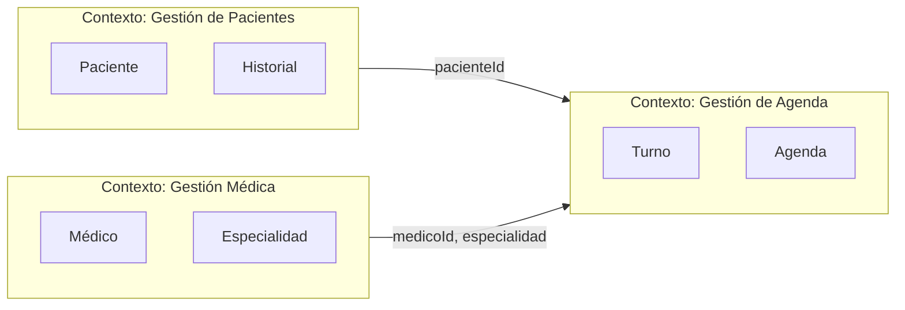
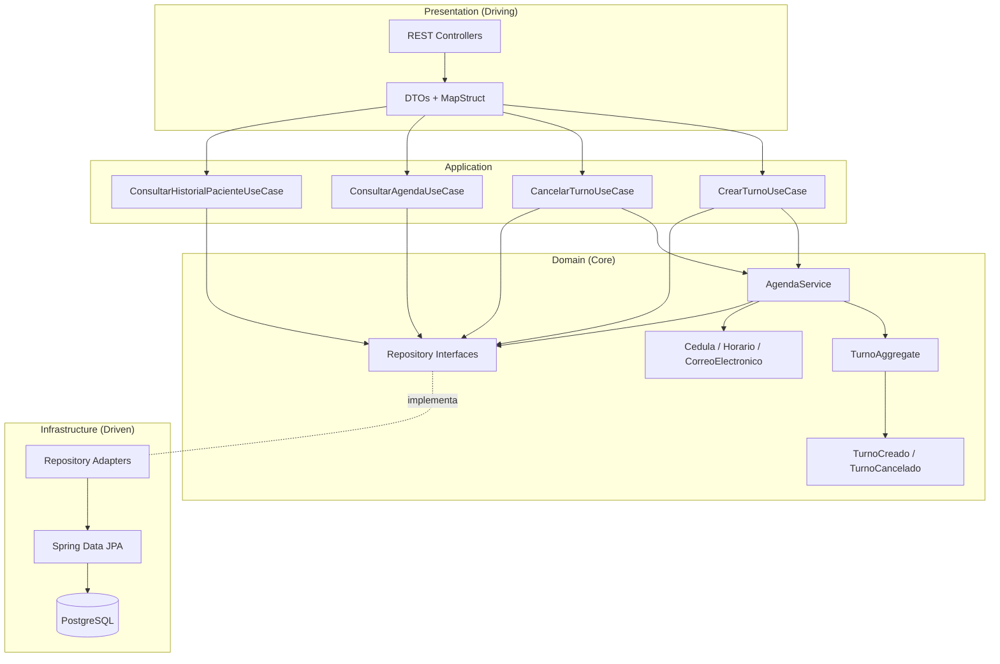
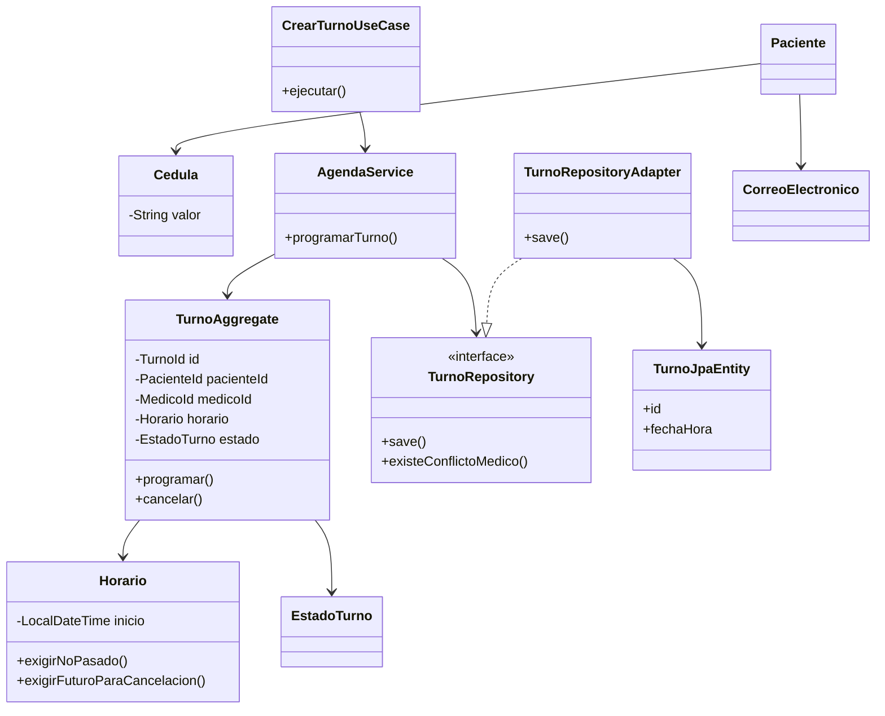
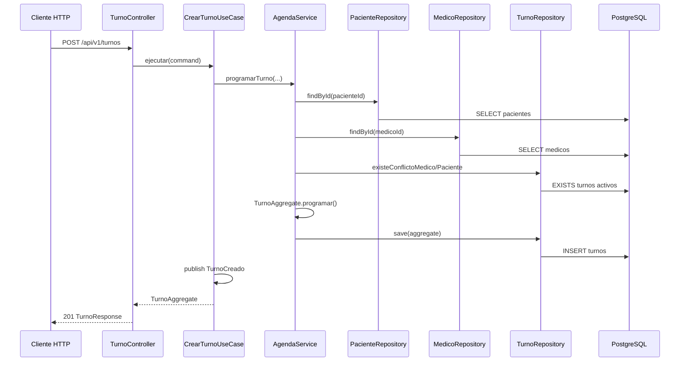
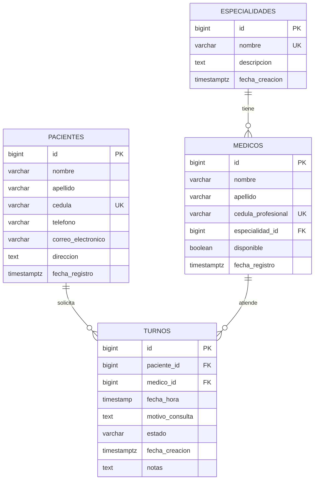

# Sistema de Gestión de Turnos Médicos — Diseño Domain-Driven Design (DDD)

> **Documento oficial de arquitectura** del proyecto. Implementación en `src/main/java/com/gestionturnos/`.
> El documento [ARQUITECTURA.md](ARQUITECTURA.md) describe la versión anterior por capas (solo referencia comparativa).

**Stack:** Java 17 · Spring Boot 3 · PostgreSQL · Maven · Lombok  
**Audiencia:** Proyecto universitario + exposición (~10 minutos)

---

## Índice

1. [Ubiquitous Language](#1-ubiquitous-language)
2. [Bounded Contexts](#2-bounded-contexts)
3. [Estructura del proyecto](#3-estructura-completa-del-proyecto)
4. [Domain Layer — código de ejemplo](#4-domain-layer)
5. [Application Layer](#5-application-layer)
6. [Infrastructure Layer](#6-infrastructure-layer)
7. [Presentation Layer](#7-presentation-layer)
8. [Diagrama de arquitectura DDD](#8-diagrama-de-arquitectura-ddd)
9. [Diagrama de clases](#9-diagrama-de-clases)
10. [Diagrama de secuencia](#10-diagrama-de-secuencia)
11. [Diagrama entidad-relación](#11-diagrama-entidad-relación)
12. [SQL completo](#12-sql-completo)
13. [Aggregates](#13-explicación-de-aggregates)
14. [Value Objects](#14-explicación-de-value-objects)
15. [Domain Services](#15-explicación-de-domain-services)
16. [Comparación: DDD vs capas](#16-comparación-con-arquitectura-por-capas)
17. [Justificación técnica de DDD](#17-justificación-técnica)

---

## 1. Ubiquitous Language

Lenguaje compartido entre médicos, administración de la clínica y el equipo de software. **Un término = un concepto** en código y en conversación.

| Término | Definición | En código |
|---------|------------|-----------|
| **Clínica** | Organización que administra el sistema | Contexto global |
| **Paciente** | Persona que solicita atención médica | `Paciente` |
| **Médico** | Profesional de salud que atiende turnos | `Medico` |
| **Especialidad** | Área médica (Cardiología, Pediatría…) | `Especialidad` |
| **Turno** | Cita programada entre paciente y médico en un horario | `Turno` / `TurnoAggregate` |
| **Agenda médica** | Conjunto de turnos futuros/no cancelados de un médico | `ConsultarAgendaUseCase` |
| **Historial del paciente** | Turnos pasados y actuales de un paciente | `ConsultarHistorialPacienteUseCase` |
| **Horario** | Instante de inicio del turno (fecha + hora) | `Horario` (VO) |
| **Cédula** | Identificador único del paciente | `Cedula` (VO) |
| **Correo electrónico** | Medio de contacto validado | `CorreoElectronico` (VO) |
| **Estado del turno** | Ciclo de vida: Programado → Completado o Cancelado | `EstadoTurno` |
| **Programar turno** | Crear un turno en estado Programado | `CrearTurnoUseCase` |
| **Cancelar turno** | Pasar a Cancelado con motivo; solo futuros y no atendidos | `CancelarTurnoUseCase` |
| **Conflicto de horario** | Dos turnos activos misma fecha/hora (médico o paciente) | Regla en `TurnoAggregate` / `AgendaService` |
| **Turno atendido** | Turno en estado Completado; no cancelable | `EstadoTurno.COMPLETADO` |
| **Disponibilidad del médico** | Flag operativo; médico puede recibir nuevos turnos | `Medico.disponible` |
| **Motivo de consulta** | Razón clínica declarada al reservar | Campo del agregado Turno |

**Eventos de dominio (lenguaje + integración futura):**

- **Turno creado** → `TurnoCreado`
- **Turno cancelado** → `TurnoCancelado`

---

## 2. Bounded Contexts

Tres contextos delimitados dentro de un **monolito modular** (un despliegue, fronteras claras en paquetes).



| Contexto | Responsabilidad | Agregados / entidades | APIs expuestas |
|----------|-----------------|----------------------|----------------|
| **Gestión de Pacientes** | Alta y consulta de pacientes; historial de turnos del paciente | `Paciente` | `POST/GET /pacientes`, `GET /pacientes/{id}/historial` |
| **Gestión Médica** | Médicos y especialidades; cada médico pertenece a una especialidad | `Medico`, `Especialidad` | `POST/GET /medicos`, `POST/GET /especialidades` |
| **Gestión de Agenda** | Ciclo de vida del turno, conflictos, agenda del médico | `TurnoAggregate` | `POST /turnos`, `PUT /turnos/{id}/cancelar`, `GET /medicos/{id}/agenda` |

**Context Map (relaciones):**

- *Pacientes* y *Médica* son **upstream** (definen identidades).
- *Agenda* es **downstream**: referencia `PacienteId` y `MedicoId` (value objects o IDs), no duplica entidades completas en el dominio del turno.

**Anti-corruption:** Los adaptadores JPA cargan entidades de persistencia; los mappers traducen a modelos de dominio puros.

---

## 3. Estructura completa del proyecto

```
medical-shifts/
├── pom.xml
├── docs/
│   ├── ARQUITECTURA.md          # Versión por capas (referencia)
│   └── ARQUITECTURA_DDD.md      # Este documento
└── src/main/java/com/gestionturnos/
    ├── TurnosMedicosApplication.java
    │
    ├── domain/                          # ★ Núcleo — sin Spring, sin JPA
    │   ├── paciente/
    │   │   ├── Paciente.java
    │   │   ├── PacienteId.java
    │   │   └── PacienteRepository.java      # interfaz
    │   ├── medico/
    │   │   ├── Medico.java
    │   │   ├── MedicoId.java
    │   │   ├── Especialidad.java
    │   │   └── MedicoRepository.java
    │   ├── agenda/
    │   │   ├── Turno.java
    │   │   ├── TurnoId.java
    │   │   ├── TurnoAggregate.java
    │   │   ├── EstadoTurno.java
    │   │   ├── TurnoRepository.java
    │   │   ├── AgendaService.java
    │   │   └── event/
    │   │       ├── DomainEvent.java
    │   │       ├── TurnoCreado.java
    │   │       └── TurnoCancelado.java
    │   └── shared/
    │       ├── Cedula.java
    │       ├── Horario.java
    │       ├── CorreoElectronico.java
    │       └── DomainException.java
    │
    ├── application/                     # Casos de uso (orquestación)
    │   ├── port/
    │   │   └── EventPublisher.java
    │   ├── turno/
    │   │   ├── CrearTurnoCommand.java
    │   │   ├── CrearTurnoUseCase.java
    │   │   ├── CancelarTurnoCommand.java
    │   │   └── CancelarTurnoUseCase.java
    │   ├── agenda/
    │   │   ├── ConsultarAgendaQuery.java
    │   │   └── ConsultarAgendaUseCase.java
    │   └── paciente/
    │       ├── ConsultarHistorialPacienteQuery.java
    │       └── ConsultarHistorialPacienteUseCase.java
    │
    ├── infrastructure/                  # Adaptadores técnicos
    │   ├── persistence/
    │   │   ├── entity/                  # JPA (@Entity)
    │   │   ├── jpa/                     # Spring Data interfaces
    │   │   └── adapter/                 # implementan domain repos
    │   ├── config/
    │   │   ├── JpaConfig.java
    │   │   └── DomainConfig.java        # beans de use cases
    │   └── event/
    │       └── SpringDomainEventPublisher.java
    │
    └── presentation/                      # Driving adapters (REST)
        ├── controller/
        ├── dto/request|response/
        ├── mapper/                      # MapStruct: DTO ↔ Application
        └── exception/
            ├── GlobalExceptionHandler.java
            └── ApiErrorResponse.java
```

**Regla de dependencia (Clean Architecture):**

```
presentation → application → domain ← infrastructure
```

`domain` no importa Spring ni JPA. `infrastructure` implementa interfaces del dominio.

---

## 4. Domain Layer

### 4.1 Value Objects (`domain/shared/`)

```java
package com.gestionturnos.domain.shared;

import java.util.Objects;
import java.util.regex.Pattern;

public final class Cedula {
    private static final Pattern FORMATO = Pattern.compile("^[0-9]{10}$");
    private final String valor;

    public Cedula(String valor) {
        if (valor == null || !FORMATO.matcher(valor.trim()).matches()) {
            throw new DomainException("Cédula inválida: debe tener 10 dígitos");
        }
        this.valor = valor.trim();
    }

    public String valor() { return valor; }

    @Override
    public boolean equals(Object o) {
        return o instanceof Cedula c && valor.equals(c.valor);
    }

    @Override
    public int hashCode() { return Objects.hash(valor); }
}
```

```java
package com.gestionturnos.domain.shared;

import java.time.LocalDateTime;
import java.util.Objects;

public final class Horario {
    private final LocalDateTime inicio;

    public Horario(LocalDateTime inicio) {
        if (inicio == null) {
            throw new DomainException("El horario es obligatorio");
        }
        this.inicio = inicio;
    }

    public void exigirNoPasado(LocalDateTime ahora) {
        if (inicio.isBefore(ahora)) {
            throw new DomainException("No se permiten turnos en fechas pasadas");
        }
    }

    public void exigirFuturoParaCancelacion(LocalDateTime ahora) {
        if (!inicio.isAfter(ahora)) {
            throw new DomainException("Solo se pueden cancelar turnos futuros");
        }
    }

    public boolean coincideCon(Horario otro) {
        return inicio.equals(otro.inicio);
    }

    public LocalDateTime inicio() { return inicio; }

    @Override
    public boolean equals(Object o) {
        return o instanceof Horario h && inicio.equals(h.inicio);
    }

    @Override
    public int hashCode() { return Objects.hash(inicio); }
}
```

```java
package com.gestionturnos.domain.shared;

import java.util.Objects;
import java.util.regex.Pattern;

public final class CorreoElectronico {
    private static final Pattern FORMATO =
            Pattern.compile("^[A-Za-z0-9+_.-]+@[A-Za-z0-9.-]+\\.[A-Za-z]{2,}$");
    private final String valor;

    public CorreoElectronico(String valor) {
        if (valor == null || !FORMATO.matcher(valor.trim()).matches()) {
            throw new DomainException("Correo electrónico inválido");
        }
        this.valor = valor.trim().toLowerCase();
    }

    public String valor() { return valor; }

    @Override
    public boolean equals(Object o) {
        return o instanceof CorreoElectronico c && valor.equals(c.valor);
    }

    @Override
    public int hashCode() { return Objects.hash(valor); }
}
```

### 4.2 Entidades y agregado (`domain/agenda/`)

```java
package com.gestionturnos.domain.agenda;

public enum EstadoTurno {
    PROGRAMADO, COMPLETADO, CANCELADO;

    public boolean esActivo() {
        return this != CANCELADO;
    }
}
```

```java
package com.gestionturnos.domain.agenda;

import com.gestionturnos.domain.medico.MedicoId;
import com.gestionturnos.domain.paciente.PacienteId;
import com.gestionturnos.domain.shared.DomainException;
import com.gestionturnos.domain.shared.Horario;

import java.time.LocalDateTime;
import java.util.ArrayList;
import java.util.List;

/**
 * Raíz del agregado Turno. Consistencia transaccional alrededor del turno.
 */
public class TurnoAggregate {

    private TurnoId id;
    private final PacienteId pacienteId;
    private final MedicoId medicoId;
    private Horario horario;
    private String motivoConsulta;
    private EstadoTurno estado;
    private String notas;
    private final List<Object> domainEvents = new ArrayList<>();

    private TurnoAggregate(PacienteId pacienteId, MedicoId medicoId,
                           Horario horario, String motivoConsulta) {
        this.pacienteId = pacienteId;
        this.medicoId = medicoId;
        this.horario = horario;
        this.motivoConsulta = motivoConsulta;
        this.estado = EstadoTurno.PROGRAMADO;
    }

    public static TurnoAggregate programar(
            PacienteId pacienteId,
            MedicoId medicoId,
            Horario horario,
            String motivo,
            LocalDateTime ahora) {
        horario.exigirNoPasado(ahora);
        TurnoAggregate turno = new TurnoAggregate(pacienteId, medicoId, horario, motivo);
        turno.domainEvents.add(new TurnoCreado(pacienteId, medicoId, horario));
        return turno;
    }

    public void cancelar(String razon, LocalDateTime ahora) {
        if (estado == EstadoTurno.COMPLETADO) {
            throw new DomainException("Un turno atendido no puede cancelarse");
        }
        if (estado == EstadoTurno.CANCELADO) {
            throw new DomainException("El turno ya fue cancelado");
        }
        horario.exigirFuturoParaCancelacion(ahora);
        estado = EstadoTurno.CANCELADO;
        notas = "Cancelado: " + (razon != null ? razon : "Sin especificar");
        domainEvents.add(new TurnoCancelado(id, pacienteId, medicoId, horario));
    }

    public List<Object> pullDomainEvents() {
        List<Object> events = new ArrayList<>(domainEvents);
        domainEvents.clear();
        return events;
    }

    // getters, asignación de id tras persistir...
    public TurnoId getId() { return id; }
    public void asignarId(TurnoId id) { this.id = id; }
    public PacienteId getPacienteId() { return pacienteId; }
    public MedicoId getMedicoId() { return medicoId; }
    public Horario getHorario() { return horario; }
    public EstadoTurno getEstado() { return estado; }
    public String getMotivoConsulta() { return motivoConsulta; }
    public String getNotas() { return notas; }
}
```

### 4.3 Repositorios (interfaces en dominio)

```java
package com.gestionturnos.domain.agenda;

import com.gestionturnos.domain.medico.MedicoId;
import com.gestionturnos.domain.paciente.PacienteId;
import com.gestionturnos.domain.shared.Horario;

import java.util.List;
import java.util.Optional;

public interface TurnoRepository {
    TurnoAggregate save(TurnoAggregate turno);
    Optional<TurnoAggregate> findById(TurnoId id);
    boolean existeConflictoMedico(MedicoId medicoId, Horario horario);
    boolean existeConflictoPaciente(PacienteId pacienteId, Horario horario);
    List<TurnoAggregate> findAgendaByMedico(MedicoId medicoId);
    List<TurnoAggregate> findHistorialByPaciente(PacienteId pacienteId);
}
```

### 4.4 Domain Service — `AgendaService`

Coordina reglas que cruzan el agregado y el repositorio (conflictos de horario).

```java
package com.gestionturnos.domain.agenda;

import com.gestionturnos.domain.medico.Medico;
import com.gestionturnos.domain.medico.MedicoId;
import com.gestionturnos.domain.medico.MedicoRepository;
import com.gestionturnos.domain.paciente.PacienteId;
import com.gestionturnos.domain.paciente.PacienteRepository;
import com.gestionturnos.domain.shared.DomainException;
import com.gestionturnos.domain.shared.Horario;

import java.time.LocalDateTime;

public class AgendaService {

    private final TurnoRepository turnoRepository;
    private final PacienteRepository pacienteRepository;
    private final MedicoRepository medicoRepository;

    public AgendaService(TurnoRepository turnoRepository,
                         PacienteRepository pacienteRepository,
                         MedicoRepository medicoRepository) {
        this.turnoRepository = turnoRepository;
        this.pacienteRepository = pacienteRepository;
        this.medicoRepository = medicoRepository;
    }

    public TurnoAggregate programarTurno(
            PacienteId pacienteId,
            MedicoId medicoId,
            Horario horario,
            String motivo,
            LocalDateTime ahora) {

        pacienteRepository.findById(pacienteId)
                .orElseThrow(() -> new DomainException("El paciente no existe"));

        Medico medico = medicoRepository.findById(medicoId)
                .orElseThrow(() -> new DomainException("El médico no existe"));

        if (!medico.isDisponible()) {
            throw new DomainException("El médico no está disponible");
        }

        if (turnoRepository.existeConflictoMedico(medicoId, horario)) {
            throw new DomainException("El médico ya tiene un turno en esa fecha y hora");
        }
        if (turnoRepository.existeConflictoPaciente(pacienteId, horario)) {
            throw new DomainException("El paciente ya tiene un turno en esa fecha y hora");
        }

        TurnoAggregate turno = TurnoAggregate.programar(
                pacienteId, medicoId, horario, motivo, ahora);
        return turnoRepository.save(turno);
    }
}
```

### 4.5 Domain Events

```java
package com.gestionturnos.domain.agenda.event;

import com.gestionturnos.domain.medico.MedicoId;
import com.gestionturnos.domain.paciente.PacienteId;
import com.gestionturnos.domain.shared.Horario;

import java.time.Instant;

public record TurnoCreado(
        PacienteId pacienteId,
        MedicoId medicoId,
        Horario horario,
        Instant ocurridoEn
) {
    public TurnoCreado(PacienteId p, MedicoId m, Horario h) {
        this(p, m, h, Instant.now());
    }
}
```

```java
package com.gestionturnos.domain.agenda.event;

import com.gestionturnos.domain.agenda.TurnoId;
import com.gestionturnos.domain.medico.MedicoId;
import com.gestionturnos.domain.paciente.PacienteId;
import com.gestionturnos.domain.shared.Horario;

import java.time.Instant;

public record TurnoCancelado(
        TurnoId turnoId,
        PacienteId pacienteId,
        MedicoId medicoId,
        Horario horario,
        Instant ocurridoEn
) {}
```

---

## 5. Application Layer

Los **casos de uso** orquestan dominio + puertos; no contienen reglas de negocio duplicadas.

```java
package com.gestionturnos.application.turno;

import com.gestionturnos.application.port.EventPublisher;
import com.gestionturnos.domain.agenda.AgendaService;
import com.gestionturnos.domain.agenda.TurnoAggregate;
import com.gestionturnos.domain.agenda.TurnoRepository;
import com.gestionturnos.domain.medico.MedicoId;
import com.gestionturnos.domain.paciente.PacienteId;
import com.gestionturnos.domain.shared.Horario;

import java.time.LocalDateTime;

public class CrearTurnoUseCase {

    private final AgendaService agendaService;
    private final EventPublisher eventPublisher;

    public CrearTurnoUseCase(AgendaService agendaService, EventPublisher eventPublisher) {
        this.agendaService = agendaService;
        this.eventPublisher = eventPublisher;
    }

    public TurnoAggregate ejecutar(CrearTurnoCommand command) {
        TurnoAggregate turno = agendaService.programarTurno(
                new PacienteId(command.pacienteId()),
                new MedicoId(command.medicoId()),
                new Horario(command.fechaHora()),
                command.motivoConsulta(),
                LocalDateTime.now());
        turno.pullDomainEvents().forEach(eventPublisher::publish);
        return turno;
    }
}
```

```java
package com.gestionturnos.application.turno;

import com.gestionturnos.application.port.EventPublisher;
import com.gestionturnos.domain.agenda.TurnoAggregate;
import com.gestionturnos.domain.agenda.TurnoId;
import com.gestionturnos.domain.agenda.TurnoRepository;
import com.gestionturnos.domain.shared.DomainException;

import java.time.LocalDateTime;

public class CancelarTurnoUseCase {

    private final TurnoRepository turnoRepository;
    private final EventPublisher eventPublisher;

    public CancelarTurnoUseCase(TurnoRepository turnoRepository, EventPublisher eventPublisher) {
        this.turnoRepository = turnoRepository;
        this.eventPublisher = eventPublisher;
    }

    public TurnoAggregate ejecutar(CancelarTurnoCommand command) {
        TurnoAggregate turno = turnoRepository.findById(new TurnoId(command.turnoId()))
                .orElseThrow(() -> new DomainException("Turno no encontrado"));
        turno.cancelar(command.razon(), LocalDateTime.now());
        TurnoAggregate guardado = turnoRepository.save(turno);
        guardado.pullDomainEvents().forEach(eventPublisher::publish);
        return guardado;
    }
}
```

```java
package com.gestionturnos.application.agenda;

import com.gestionturnos.domain.agenda.TurnoAggregate;
import com.gestionturnos.domain.agenda.TurnoRepository;
import com.gestionturnos.domain.medico.MedicoId;

import java.util.List;

public class ConsultarAgendaUseCase {

    private final TurnoRepository turnoRepository;

    public ConsultarAgendaUseCase(TurnoRepository turnoRepository) {
        this.turnoRepository = turnoRepository;
    }

    public List<TurnoAggregate> ejecutar(ConsultarAgendaQuery query) {
        return turnoRepository.findAgendaByMedico(new MedicoId(query.medicoId()));
    }
}
```

```java
package com.gestionturnos.application.paciente;

import com.gestionturnos.domain.agenda.TurnoAggregate;
import com.gestionturnos.domain.agenda.TurnoRepository;
import com.gestionturnos.domain.paciente.PacienteId;

import java.util.List;

public class ConsultarHistorialPacienteUseCase {

    private final TurnoRepository turnoRepository;

    public ConsultarHistorialPacienteUseCase(TurnoRepository turnoRepository) {
        this.turnoRepository = turnoRepository;
    }

    public List<TurnoAggregate> ejecutar(ConsultarHistorialPacienteQuery query) {
        return turnoRepository.findHistorialByPaciente(new PacienteId(query.pacienteId()));
    }
}
```

**Commands / Queries (records):**

```java
public record CrearTurnoCommand(Long pacienteId, Long medicoId,
                              java.time.LocalDateTime fechaHora, String motivoConsulta) {}
public record CancelarTurnoCommand(Long turnoId, String razon) {}
public record ConsultarAgendaQuery(Long medicoId) {}
public record ConsultarHistorialPacienteQuery(Long pacienteId) {}
```

---

## 6. Infrastructure Layer

### 6.1 Entidad JPA (separada del dominio)

```java
@Entity
@Table(name = "turnos")
public class TurnoJpaEntity {
    @Id @GeneratedValue(strategy = GenerationType.IDENTITY)
    private Long id;
    @Column(name = "paciente_id", nullable = false) private Long pacienteId;
    @Column(name = "medico_id", nullable = false) private Long medicoId;
    @Column(name = "fecha_hora", nullable = false) private LocalDateTime fechaHora;
    private String motivoConsulta;
    @Enumerated(EnumType.STRING) private EstadoTurno estado;
    private String notas;
    // getters/setters
}
```

### 6.2 Adaptador de repositorio

```java
@Repository
@RequiredArgsConstructor
public class TurnoRepositoryAdapter implements TurnoRepository {

    private final TurnoJpaRepository jpa;
    private final TurnoPersistenceMapper mapper;

    @Override
    public TurnoAggregate save(TurnoAggregate turno) {
        TurnoJpaEntity entity = mapper.toEntity(turno);
        TurnoJpaEntity saved = jpa.save(entity);
        turno.asignarId(new TurnoId(saved.getId()));
        return turno;
    }

    @Override
    public boolean existeConflictoMedico(MedicoId medicoId, Horario horario) {
        return jpa.existsByMedicoIdAndFechaHoraAndEstadoNot(
                medicoId.value(), horario.inicio(), EstadoTurno.CANCELADO);
    }
    // ...
}
```

### 6.3 `pom.xml` — MapStruct

```xml
<properties>
    <mapstruct.version>1.6.3</mapstruct.version>
</properties>
<dependencies>
    <dependency>
        <groupId>org.mapstruct</groupId>
        <artifactId>mapstruct</artifactId>
        <version>${mapstruct.version}</version>
    </dependency>
</dependencies>
<build>
    <plugins>
        <plugin>
            <groupId>org.apache.maven.plugins</groupId>
            <artifactId>maven-compiler-plugin</artifactId>
            <configuration>
                <annotationProcessorPaths>
                    <path>
                        <groupId>org.projectlombok</groupId>
                        <artifactId>lombok</artifactId>
                    </path>
                    <path>
                        <groupId>org.mapstruct</groupId>
                        <artifactId>mapstruct-processor</artifactId>
                        <version>${mapstruct.version}</version>
                    </path>
                    <path>
                        <groupId>org.projectlombok</groupId>
                        <artifactId>lombok-mapstruct-binding</artifactId>
                        <version>0.2.0</version>
                    </path>
                </annotationProcessorPaths>
            </configuration>
        </plugin>
    </plugins>
</build>
```

### 6.4 MapStruct — presentación

```java
@Mapper(componentModel = "spring")
public interface TurnoDtoMapper {
  TurnoResponse toResponse(TurnoAggregate turno);
  AgendaMedicaResponse toAgenda(Medico medico, List<TurnoAggregate> turnos);
}
```

---

## 7. Presentation Layer

```java
@RestController
@RequestMapping("/api/v1")
@RequiredArgsConstructor
public class TurnoController {

    private final CrearTurnoUseCase crearTurno;
    private final CancelarTurnoUseCase cancelarTurno;
    private final ConsultarAgendaUseCase consultarAgenda;
    private final TurnoDtoMapper mapper;

    @PostMapping("/turnos")
    public ResponseEntity<TurnoResponse> crear(@Valid @RequestBody TurnoRequest request) {
        var turno = crearTurno.ejecutar(new CrearTurnoCommand(
                request.pacienteId(), request.medicoId(),
                request.fechaHora(), request.motivoConsulta()));
        return ResponseEntity.status(HttpStatus.CREATED).body(mapper.toResponse(turno));
    }

    @PutMapping("/turnos/{id}/cancelar")
    public TurnoResponse cancelar(@PathVariable Long id,
                                  @Valid @RequestBody CancelarTurnoRequest request) {
        var turno = cancelarTurno.ejecutar(new CancelarTurnoCommand(id, request.razon()));
        return mapper.toResponse(turno);
    }

    @GetMapping("/medicos/{medicoId}/agenda")
    public AgendaMedicaResponse agenda(@PathVariable Long medicoId) {
        var turnos = consultarAgenda.ejecutar(new ConsultarAgendaQuery(medicoId));
        // enriquecer con datos de médico vía query service o segundo puerto
        return mapper.toAgenda(/* medico */, turnos);
    }
}
```

```java
@RestControllerAdvice
public class GlobalExceptionHandler {

    @ExceptionHandler(DomainException.class)
    public ResponseEntity<ApiErrorResponse> domain(DomainException ex) {
        return ResponseEntity.badRequest().body(
                new ApiErrorResponse("BUSINESS_ERROR", ex.getMessage()));
    }
}
```

---

## 8. Diagrama de arquitectura DDD



**Hexágono:** el dominio está en el centro; la aplicación define casos de uso; infraestructura y REST son adaptadores.

---

## 9. Diagrama de clases



---

## 10. Diagrama de secuencia — Crear turno



---

## 11. Diagrama entidad-relación



---

## 12. SQL completo

Ver archivo ejecutable: `src/main/resources/db/schema-postgresql.sql`

```sql
-- Esquema PostgreSQL — Gestión de Turnos Médicos (DDD)

CREATE TABLE IF NOT EXISTS especialidades (
    id              BIGSERIAL PRIMARY KEY,
    nombre          VARCHAR(100) NOT NULL UNIQUE,
    descripcion     TEXT,
    fecha_creacion  TIMESTAMPTZ NOT NULL DEFAULT NOW()
);

CREATE TABLE IF NOT EXISTS pacientes (
    id                  BIGSERIAL PRIMARY KEY,
    nombre              VARCHAR(100) NOT NULL,
    apellido            VARCHAR(100) NOT NULL,
    cedula              VARCHAR(20) NOT NULL UNIQUE,
    telefono            VARCHAR(20),
    correo_electronico  VARCHAR(100),
    direccion           TEXT,
    fecha_registro      TIMESTAMPTZ NOT NULL DEFAULT NOW(),
    CONSTRAINT chk_paciente_cedula CHECK (cedula ~ '^[0-9]{10}$')
);

CREATE TABLE IF NOT EXISTS medicos (
    id                  BIGSERIAL PRIMARY KEY,
    nombre              VARCHAR(100) NOT NULL,
    apellido            VARCHAR(100) NOT NULL,
    cedula_profesional  VARCHAR(20) NOT NULL UNIQUE,
    telefono            VARCHAR(20),
    email               VARCHAR(100),
    especialidad_id     BIGINT NOT NULL REFERENCES especialidades(id),
    disponible          BOOLEAN NOT NULL DEFAULT TRUE,
    fecha_registro      TIMESTAMPTZ NOT NULL DEFAULT NOW()
);

CREATE TABLE IF NOT EXISTS turnos (
    id               BIGSERIAL PRIMARY KEY,
    paciente_id      BIGINT NOT NULL REFERENCES pacientes(id) ON DELETE CASCADE,
    medico_id        BIGINT NOT NULL REFERENCES medicos(id) ON DELETE RESTRICT,
    fecha_hora       TIMESTAMP NOT NULL,
    motivo_consulta  TEXT,
    estado           VARCHAR(20) NOT NULL DEFAULT 'PROGRAMADO'
                     CHECK (estado IN ('PROGRAMADO', 'COMPLETADO', 'CANCELADO')),
    fecha_creacion   TIMESTAMPTZ NOT NULL DEFAULT NOW(),
    notas            TEXT
);

-- Índices de consulta
CREATE INDEX IF NOT EXISTS idx_turnos_paciente ON turnos(paciente_id);
CREATE INDEX IF NOT EXISTS idx_turnos_medico ON turnos(medico_id);
CREATE INDEX IF NOT EXISTS idx_turnos_fecha ON turnos(fecha_hora);
CREATE INDEX IF NOT EXISTS idx_turnos_estado ON turnos(estado);

-- Reglas 1 y 2: unicidad de turno activo por médico/paciente y hora
CREATE UNIQUE INDEX IF NOT EXISTS uk_turno_medico_hora_activo
    ON turnos (medico_id, fecha_hora)
    WHERE estado <> 'CANCELADO';

CREATE UNIQUE INDEX IF NOT EXISTS uk_turno_paciente_hora_activo
    ON turnos (paciente_id, fecha_hora)
    WHERE estado <> 'CANCELADO';

-- Datos de demostración (opcional)
INSERT INTO especialidades (nombre, descripcion) VALUES
    ('Cardiología', 'Enfermedades del corazón'),
    ('Pediatría', 'Atención infantil')
ON CONFLICT (nombre) DO NOTHING;
```

**Mapeo reglas de negocio ↔ persistencia:**

| Regla | Dominio | Base de datos |
|-------|---------|---------------|
| Sin doble turno médico/paciente | `AgendaService` + `TurnoRepository` | Índices únicos parciales |
| Sin turnos pasados | `Horario.exigirNoPasado()` | — |
| Solo cancelar futuros | `Horario.exigirFuturoParaCancelacion()` | — |
| No cancelar atendidos | `TurnoAggregate.cancelar()` | CHECK estado |
| Médico con especialidad | `Medico.especialidadId` | FK `especialidad_id` |

---

## 13. Explicación de Aggregates

**Aggregate (agregado):** cluster de objetos de dominio tratados como **una unidad de consistencia** para cambios y transacciones.

En este sistema, **`TurnoAggregate` es la raíz del agregado de Agenda**:

- **Raíz:** `TurnoAggregate` — único punto de entrada para modificar el turno.
- **Invariantes protegidas:**
  - No programar en el pasado.
  - No cancelar si está `COMPLETADO` o ya `CANCELADO`.
  - Solo cancelar turnos **futuros**.
- **Referencias externas por ID:** `PacienteId`, `MedicoId` (no se cargan entidades completas dentro del agregado).
- **Eventos:** `TurnoCreado`, `TurnoCancelado` se registran dentro del agregado y se publican tras `save`.

**¿Por qué Paciente y Médico no son el mismo agregado que Turno?**  
Porque viven en **bounded contexts** distintos y tienen ciclos de vida independientes. Mezclarlos inflaría transacciones y acoplaría “cambiar teléfono del paciente” con “cancelar turno”.

**Regla práctica:** una transacción = un agregado. Los conflictos de horario consultan el repositorio (otros agregados Turno) vía `AgendaService`.

---

## 14. Explicación de Value Objects

Los **Value Objects (VO)** describen conceptos sin identidad propia: se comparan por **valor**, son **inmutables** y encapsulan validación.

| VO | Responsabilidad | Beneficio |
|----|-----------------|-----------|
| `Cedula` | Formato 10 dígitos | Imposible persistir cédula inválida si el dominio la usa |
| `Horario` | Instante del turno + reglas temporales | Reglas 3 y 4 viven en un solo lugar |
| `CorreoElectronico` | Formato RFC simplificado | Evita strings “sucios” en `Paciente` |

**Diferencia con entidad:** `Paciente` tiene `PacienteId` persistente; dos pacientes con misma cédula serían error de negocio, no “el mismo objeto”.

**En el proyecto actual (capas):** `cedula` y `fechaHora` son `String` / `LocalDateTime` en entidades JPA. En DDD migran a VO en el dominio; el **mapper de infraestructura** convierte `String` ↔ `Cedula`.

---

## 15. Explicación de Domain Services

Un **Domain Service** encapsula lógica de dominio que **no pertenece naturalmente** a una sola entidad/agregado.

**`AgendaService`**:

- Valida existencia de paciente y médico (colaboradores de otros contextos).
- Verifica disponibilidad del médico.
- Consulta **conflictos de horario** en otros registros de turno (reglas 1 y 2).
- Delega la creación invariante a `TurnoAggregate.programar()`.

**No confundir con Application Service / Use Case:**

| Capa | Ejemplo | Rol |
|------|---------|-----|
| Domain Service | `AgendaService` | Reglas puras de negocio |
| Use Case | `CrearTurnoUseCase` | Orquestación, transacción, publicar eventos |
| Service (capas) | `TurnoService` actual | Mezcla ambos + depende de JPA |

---

## 16. Comparación con arquitectura por capas

El repositorio actual (`com.gestionturnos.service.TurnoService`) implementa reglas correctamente, pero:

| Aspecto | Por capas (actual) | DDD propuesto |
|---------|-------------------|---------------|
| Modelo | Entidades JPA = modelo de negocio | Dominio puro + entidades JPA separadas |
| Reglas | En `TurnoService` | En `TurnoAggregate`, `Horario`, `AgendaService` |
| Testabilidad | Requiere Spring/JPA o mocks pesados | Dominio testeable sin framework |
| Lenguaje | Técnico (Entity, Service) | Ubiquitous Language en paquetes |
| Evolución | Riesgo de “anémico” (lógica fuera del modelo) | Modelo rico + casos de uso explícitos |
| Complejidad inicial | Menor | Mayor (mappers, doble modelo) |

**Cuándo mantener capas:** CRUD simple sin reglas cruzadas.  
**Cuándo DDD:** Múltiples reglas, estados, conflictos y vocabulario de negocio estable — **este dominio califica**.

---

## 17. Justificación técnica

1. **Reglas no triviales y compartidas:** conflictos médico/paciente, ventanas temporales, estados terminados — pertenecen al **dominio**, no al controller.
2. **Vocabulario estable:** turno, agenda, historial, cancelación — alinean código y requisitos (menos defectos en validación).
3. **Evolución:** notificaciones (`TurnoCreado`), integración con facturación o historias clínicas, sin reescribir `TurnoService` monolítico.
4. **Testes de aceptación del negocio:** `TurnoAggregateTest` sin base de datos valida reglas 3–5 en milisegundos.
5. **Fronteras claras:** tres bounded contexts permiten equipos o módulos futuros (microservicios) sin romper el monolito actual.
6. **Integridad en BD + dominio:** índices únicos parciales son **última línea de defensa**; el dominio expresa la intención antes de persistir.

**Coste aceptado:** más clases y mappers (MapStruct mitiga boilerplate). Para un proyecto universitario que debe **demostrar arquitectura**, el beneficio pedagógico y profesional supera el overhead en un dominio acotado pero realista.

---

## Guía rápida para exposición (10 minutos)

| Min | Tema |
|-----|------|
| 0–1 | Problema: clínica, turnos, 6 reglas |
| 1–2 | Ubiquitous Language + 3 bounded contexts |
| 2–4 | Diagrama hexagonal + `TurnoAggregate` |
| 4–6 | Secuencia crear turno + VO `Horario` |
| 6–7 | `AgendaService` vs Use Case |
| 7–8 | ER + índices únicos |
| 8–9 | DDD vs capas (tabla) |
| 9–10 | Conclusión: dominio rico, tests, evolución |

---

## Relación con el código actual

El proyecto en `src/main/java/com/gestionturnos/` implementa hoy **arquitectura por capas** documentada en `docs/ARQUITECTURA.md`. La migración a DDD es **incremental**:

1. Extraer reglas de `TurnoService` a `TurnoAggregate` + `Horario`.
2. Introducir paquete `domain/` sin JPA.
3. Renombrar `service` → `application` (use cases) y `repository` JPA → `infrastructure/persistence`.
4. Mantener contratos REST (`/api/v1/...`) para no romper la UI estática.

Los endpoints y el SQL existente son **compatibles** con este diseño.
